# hAITour: Pfinz → Pforte → Rhein 🚴‍♂️🌊

<p align="center">
  
</p>

<p align="center">
  <a href="https://www.buymeacoffee.com/highfish">
    
  </a>
</p>


> **Hybrid AI Tour** – Eine Fahrradtour von der Pfinz über die Pforte bis zum Rhein, dokumentiert mit Karten, Bildern und GitHub Pages. 🤖🚴

---

## 🎬 Tour-Video – Einstieg

<p align="center">
  <a href="https://youtu.be/RSTAwrHcaKQ" target="_blank">
    
  </a>
  <br />
  <sub><b>▶️ Klicken zum Abspielen – Einstiegsvideo zur Tour</b></sub>
</p>

---

## 🎥 Videotagebuch der Tour

<table>
  <tr>
    <td align="center" width="25%">
      <a href="https://youtu.be/RSTAwrHcaKQ" target="_blank">
        
      </a>
      <br /><sub><b>🎬 Video 1 – Start &amp; Überblick</b></sub>
    </td>
    <td align="center" width="25%">
      <a href="https://youtu.be/JUY0DWyIJ3w" target="_blank">
        
      </a>
      <br /><sub><b>🚴 Video 2 – Teil 1: Pfinz → Pforte</b></sub>
    </td>
    <td align="center" width="25%">
      <a href="https://youtu.be/WQrAl2K4ps8" target="_blank">
        
      </a>
      <br /><sub><b>🌾 Video 3 – Teil 2: Pfinztal</b></sub>
    </td>
    <td align="center" width="25%">
      <a href="https://youtu.be/YJrDHmcwbNc" target="_blank">
        
      </a>
      <br /><sub><b>🌊 Video 4 – Teil 3: Zum Rhein</b></sub>
    </td>
  </tr>
</table>

### 📱 Bonus-Short

<table>
  <tr>
    <td align="center" width="25%">
      <a href="https://youtube.com/shorts/M6jf79YP6Gk" target="_blank">
        
      </a>
      <br /><sub><b>📱 Video 5 – Shorts-Clip der Tour &nbsp;</b></sub>
    </td>
    <td width="75%"></td>
  </tr>
</table>

> 💡 **Tipp:** Auf ein Thumbnail klicken → direkt zu YouTube!

---

## 🌍 Überblick

Diese Repository begleitet meine Fahrradtour von der **Pfinz** über die **Pforte** bis zum **Rhein**.

Die Tour ist in drei Abschnitte aufgeteilt:

1. **Teil 1 – Start an der Pfinz / Pforte** → [Google Maps](https://maps.app.goo.gl/gPDNqdz4Gan2su3x5)
2. **Teil 2 – Mittlerer Abschnitt** → [Google Maps](https://maps.app.goo.gl/Lzt2sL145VXShjhs9)
3. **Teil 3 – Finale bis zum Rhein** → [Google Maps](https://maps.app.goo.gl/dZFYExEyQecgXBL58)

---

## 📥 GPX-Tracks herunterladen

| Abschnitt | Google Maps | GPX Download |
|---|---|---|
| 🚴 Teil 1 – Pfinz / Pforte | [Maps 🗺️](https://maps.app.goo.gl/gPDNqdz4Gan2su3x5) | [⬇️ GPX herunterladen](docs/teil1_pfinz_pforte.gpx) |
| 🚴 Teil 2 – Pfinztal | [Maps 🗺️](https://maps.app.goo.gl/Lzt2sL145VXShjhs9) | [⬇️ GPX herunterladen](docs/teil2_pfinztal.gpx) |
| 🚴 Teil 3 – Zum Rhein | [Maps 🗺️](https://maps.app.goo.gl/dZFYExEyQecgXBL58) | [⬇️ GPX herunterladen](docs/teil3_zum_rhein.gpx) |

> 💡 **Hinweis:** Die GPX-Tracks liegen im Ordner `docs/` und können direkt heruntergeladen werden.

---

## 🖼️ Fotogalerie der Tour

### 🟢 Teil 1 – Pfinz zur Pforte

<table>
  <tr>
    <td align="center" width="25%">
      <a href="images/teil1/01_start_pfinz.png">
        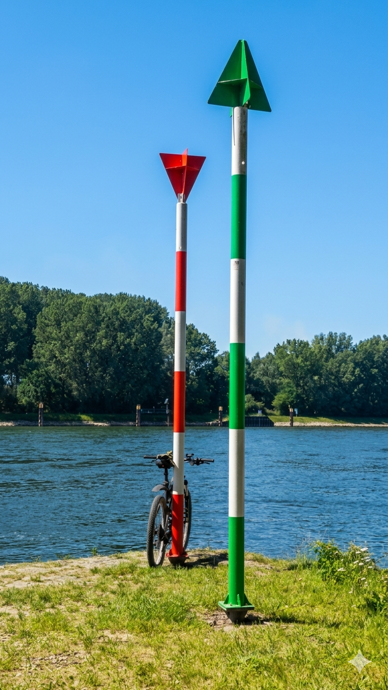
      </a>
      <br /><sub><b>🚴 Start an der Pfinz</b></sub>
    </td>
    <td align="center" width="25%">
      <a href="images/teil1/02_pfinzufer.png">
        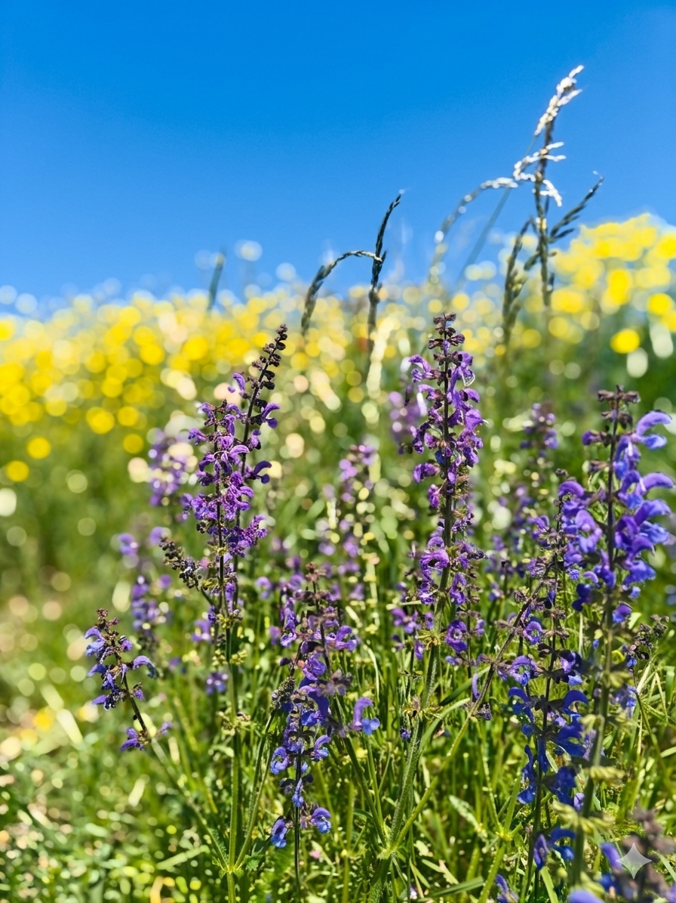
      </a>
      <br /><sub><b>🌿 Am Pfinzufer</b></sub>
    </td>
    <td align="center" width="25%">
      <a href="images/teil1/03_bruecke_pfinz.png">
        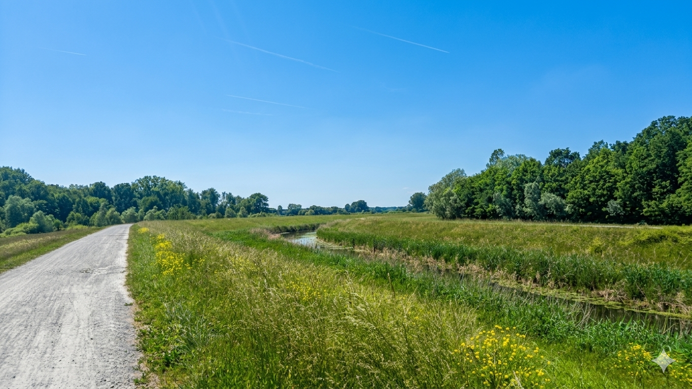
      </a>
      <br /><sub><b>🌉 Brücke über die Pfinz</b></sub>
    </td>
    <td align="center" width="25%">
      <a href="images/teil1/04_wegpunkt_pforte.png">
        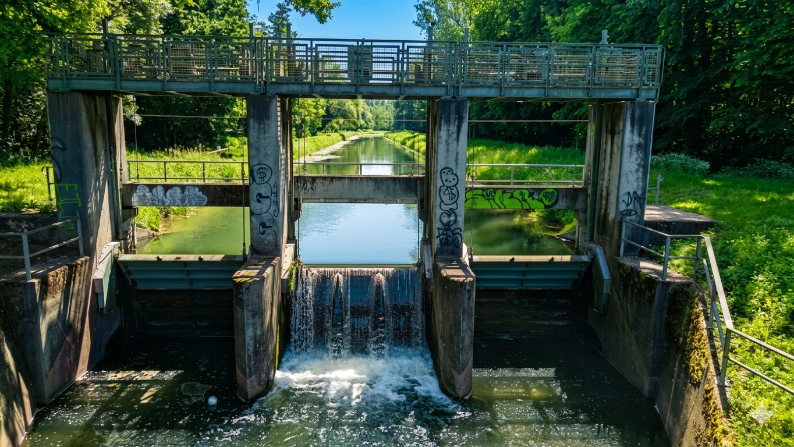
      </a>
      <br /><sub><b>📍 Wegpunkt Pforte</b></sub>
    </td>
  </tr>
</table>

### 🔵 Teil 2 – Durch das Pfinztal

<table>
  <tr>
    <td align="center" width="25%">
      <a href="images/teil2/01_pfinztal_sued.png">
        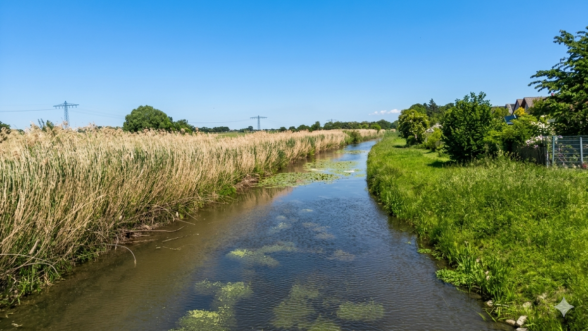
      </a>
      <br /><sub><b>🌄 Pfinztal Süd</b></sub>
    </td>
    <td align="center" width="25%">
      <a href="images/teil2/02_pfinztal_mitte.png">
        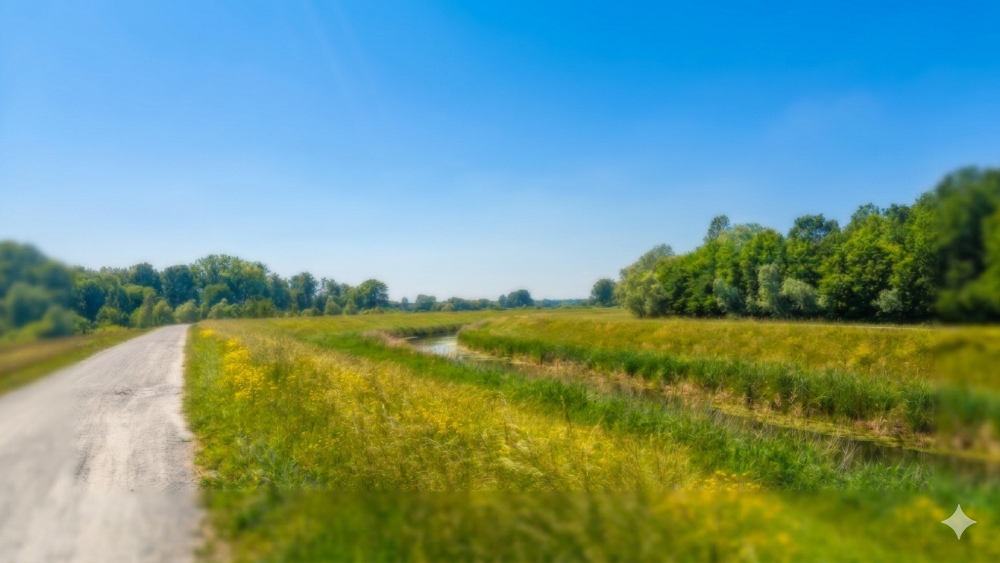
      </a>
      <br /><sub><b>🌾 Pfinztal Mitte</b></sub>
    </td>
    <td align="center" width="25%">
      <a href="images/teil2/03_ortsdurchfahrt.png">
        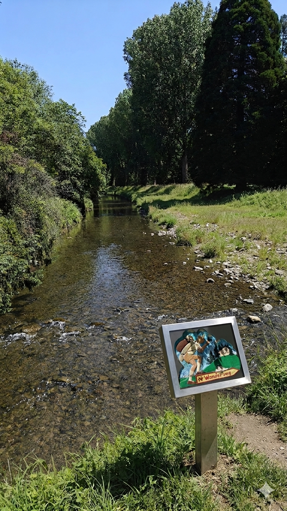
      </a>
      <br /><sub><b>🏘️ Ortsdurchfahrt</b></sub>
    </td>
    <td align="center" width="25%">
      <a href="images/teil2/04_pfinztal_nord.png">
        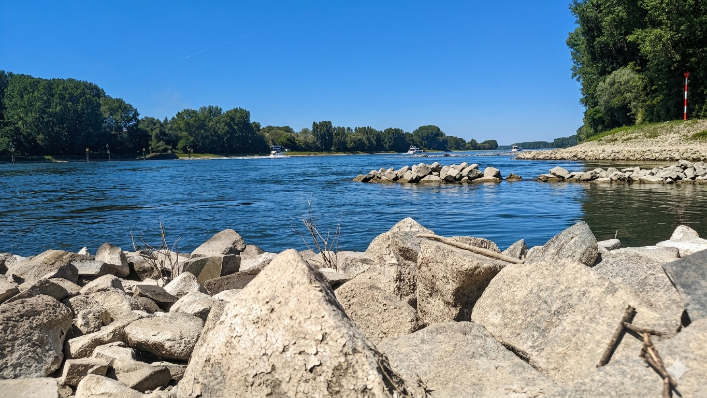
      </a>
      <br /><sub><b>🌳 Pfinztal Nord</b></sub>
    </td>
  </tr>
</table>

### 🔴 Teil 3 – Zum Rhein

<table>
  <tr>
    <td align="center" width="33%">
      <a href="images/teil3/01_richtung_rhein.png">
        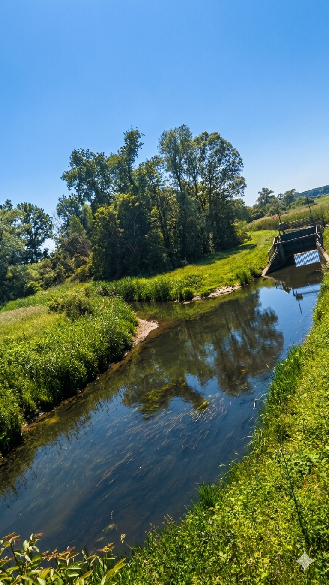
      </a>
      <br /><sub><b>➡️ Richtung Rhein</b></sub>
    </td>
    <td align="center" width="33%">
      <a href="images/teil3/02_rheinradweg.png">
        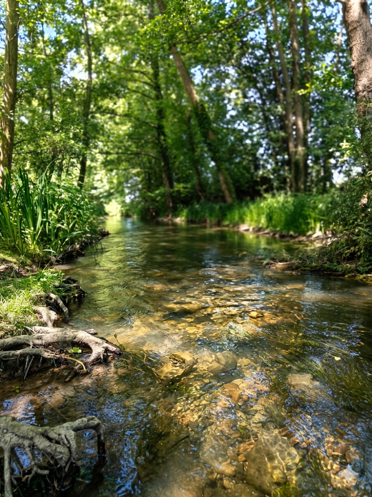
      </a>
      <br /><sub><b>🛣️ Am Rheinradweg</b></sub>
    </td>
    <td align="center" width="33%">
      <a href="images/teil3/03_ankunft_rhein.png">
        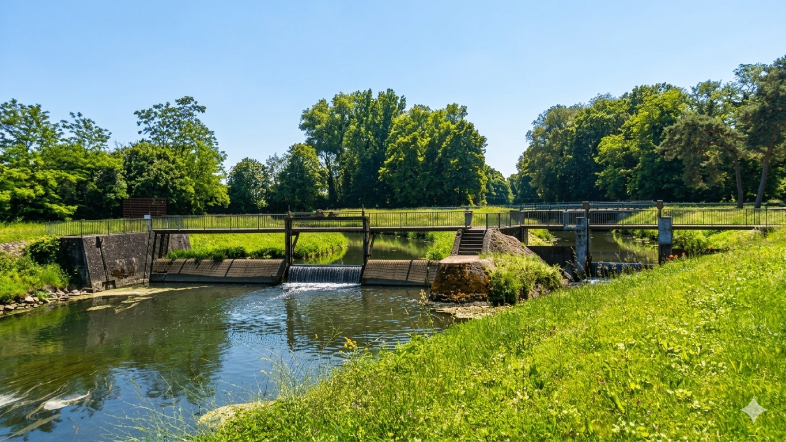
      </a>
      <br /><sub><b>🏁🌊 Ankunft am Rhein</b></sub>
    </td>
  </tr>
</table>

---

## 🗺️ Karten & Abschnitte

### Teil 1: Pfinz → Pforte
- Start: Nähe Pfinz / Pfinztal
- Charakter: Einrollen, eher entspannt, viel Grün 🌳
- Route: [Teil 1 auf Google Maps](https://maps.app.goo.gl/gPDNqdz4Gan2su3x5)

### Teil 2: Durch das Pfinztal
- Verbindungsetappe zwischen Pforte und Richtung Rhein
- Mehr Mischverkehr, Radwege & kleine Orte 🏘️
- Route: [Teil 2 auf Google Maps](https://maps.app.goo.gl/Lzt2sL145VXShjhs9)

### Teil 3: Zum Rhein
- Ziel: Rhein-Nähe / Rheinradweg 🌊
- Route: [Teil 3 auf Google Maps](https://maps.app.goo.gl/dZFYExEyQecgXBL58)

---

## 🧱 Projektstruktur

```text
hAITour.Pfinz.I.Pforte.bis.Rhein/
├─ README.md                  ← diese Datei
├─ index.html                 ← GitHub Pages Startseite
├─ LICENSE                    ← MIT Lizenz
├─ logo_PfinzPforteRhein.png  ← Tour-Logo
├─ images/                    ← Fotos der Tour (Wegpunkte)
│   ├─ teil1/  (4 Bilder)
│   ├─ teil2/  (4 Bilder)
│   └─ teil3/  (3 Bilder)
└─ docs/
    ├─ teil1_pfinz_pforte.gpx  ← GPX-Track Teil 1
    ├─ teil2_pfinztal.gpx      ← GPX-Track Teil 2
    └─ teil3_zum_rhein.gpx     ← GPX-Track Teil 3
```

---

## 📄 Lizenz

Dieses Projekt steht unter der **MIT-Lizenz**. Details siehe [`LICENSE`](LICENSE).
